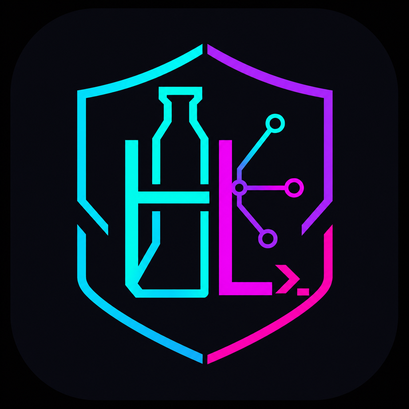

<p align="center">
  
</p>

<h1 align="center">HarneesLab</h1>

<p align="center">
  AI 코딩을 결정적이고 반복 가능한 개발 workflow로 만드는 오픈소스 harness builder.
</p>

<p align="center">
  <a href="LICENSE"></a>
  <a href="https://github.com/NewTurn2017/HarneesLab/actions/workflows/test.yml"></a>
  <a href="https://harnesslab.codewithgenie.com"></a>
</p>

---

HarneesLab은 AI 코딩 agent를 위한 workflow engine입니다. 계획, 구현, 검증, 코드 리뷰, PR 생성 같은 개발 절차를 YAML workflow로 정의하고, 여러 프로젝트에서 같은 방식으로 반복 실행할 수 있습니다.

HarneesLab은 AI coding workflow를 한국어 우선 제품 경험과 독립 네임스페이스로 다듬은 local-first developer tool입니다. 저장소, 릴리스, 문서, CLI, runtime directory, logo와 favicon까지 HarneesLab brand surface를 기준으로 유지합니다.

Dockerfile이 인프라를, GitHub Actions가 CI/CD를 반복 가능하게 만든 것처럼 HarneesLab은 AI 코딩 workflow를 반복 가능하게 만듭니다. 소프트웨어 개발을 위한 n8n에 가깝게 생각하면 됩니다.

## HarneesLab이 필요한 이유

AI agent에게 "이 버그 고쳐줘"라고 말하면 실행 결과는 매번 달라질 수 있습니다. 어떤 run에서는 계획을 생략하고, 어떤 run에서는 테스트를 빼먹고, 어떤 run에서는 PR 설명이 팀 템플릿과 맞지 않습니다.

HarneesLab은 이 부분을 workflow로 고정합니다. workflow는 단계, 검증 gate, 산출물을 정의합니다. AI는 각 단계에서 필요한 판단과 구현을 맡고, 전체 구조는 사용자가 소유한 deterministic process로 남습니다.

- **반복 가능**: 같은 workflow는 매번 같은 순서로 실행됩니다. Plan, implement, validate, review, PR.
- **격리 실행**: 각 workflow run은 독립된 git worktree에서 실행됩니다. 여러 수정 작업을 병렬로 돌려도 branch 충돌이 줄어듭니다.
- **비동기 작업**: workflow를 시작한 뒤 다른 일을 하다가, 리뷰 코멘트가 포함된 PR 결과로 돌아올 수 있습니다.
- **조합 가능**: bash script, test, git operation 같은 deterministic node와 planning, code generation, review 같은 AI node를 함께 구성합니다.
- **이식 가능**: `.harneeslab/workflows/`에 workflow를 정의하고 repo에 commit하면 CLI, Web UI, Slack, Telegram, GitHub에서 같은 절차로 실행됩니다.

## 실행 예시

다음은 기능 구현을 계획하고, 테스트가 통과할 때까지 구현 loop를 돌고, 사람 승인을 받은 뒤 PR을 만드는 HarneesLab workflow 예시입니다.

```yaml
# .harneeslab/workflows/build-feature.yaml
nodes:
  - id: plan
    prompt: "Explore the codebase and create an implementation plan"

  - id: implement
    depends_on: [plan]
    loop:                                      # AI loop - iterate until done
      prompt: "Read the plan. Implement the next task. Run validation."
      until: ALL_TASKS_COMPLETE
      fresh_context: true                      # Fresh session each iteration

  - id: run-tests
    depends_on: [implement]
    bash: "bun run validate"                   # Deterministic - no AI

  - id: review
    depends_on: [run-tests]
    prompt: "Review all changes against the plan. Fix any issues."

  - id: approve
    depends_on: [review]
    loop:                                      # Human approval gate
      prompt: "Present the changes for review. Address any feedback."
      until: APPROVED
      interactive: true                        # Pauses and waits for human input

  - id: create-pr
    depends_on: [approve]
    prompt: "Push changes and create a pull request"
```

작업 repo에서 agent에게 요청하면 HarneesLab이 workflow 선택, branch 생성, worktree 격리, 검증, PR 생성을 처리합니다.

```text
사용자: hlab로 설정 페이지에 다크 모드를 추가해줘

에이전트: 이 작업에는 harneeslab-idea-to-pr workflow를 실행하겠습니다.
       -> hlab/task-dark-mode branch에 격리 worktree 생성...
       -> 계획 수립...
       -> 구현 중(task 1/4)...
       -> 구현 중(task 2/4)...
       -> test 실패 - 반복 수정...
       -> 2번 반복 후 test 통과
       -> code review 완료 - issue 0개
       -> PR 준비 완료: https://github.com/you/project/pull/47
```

## 독립 네임스페이스 정책

HarneesLab은 public brand, GitHub repository, npm package scope, CLI binary, runtime directory, workflow namespace를 모두 HarneesLab 기준으로 사용합니다.

| 영역 | 현재 기준 |
| --- | --- |
| Repository | `NewTurn2017/HarneesLab` |
| Package scope | `@harneeslab/*` |
| CLI binary | `hlab` |
| Repo-local workflow directory | `.harneeslab/` |
| Bundled workflow/command namespace | `harneeslab-*` |
| Local default home | `~/.harneeslab` |

HarneesLab은 hard-cutover 이후 pre-rebrand runtime fallback을 기본 동작으로 지원하지 않습니다. 새 custom runtime 위치가 필요하면 `HARNEESLAB_HOME`을 사용하고, Docker host data 위치는 `HARNEESLAB_DATA`로 지정합니다.

## 시작하기

처음 사용하는 경우에는 **전체 설정**을 권장합니다. credential, platform integration, HarneesLab skill 설치, Web dashboard까지 한 번에 설정합니다.

Claude Code가 이미 준비되어 있고 CLI만 빠르게 쓰려면 **빠른 설치**로 바로 시작할 수 있습니다.

### 전체 설정 (5분)

repo를 clone한 뒤 guided setup wizard를 실행합니다. 이 과정은 CLI 설치, 인증, platform 선택, target project에 HarneesLab skill 복사를 처리합니다.

<details>
<summary><b>필수 도구</b>: Bun, Claude Code, GitHub CLI</summary>

**Bun**: [bun.sh](https://bun.sh)

```bash
# macOS/Linux
curl -fsSL https://bun.sh/install | bash

# Windows (PowerShell)
irm bun.sh/install.ps1 | iex
```

**GitHub CLI**: [cli.github.com](https://cli.github.com/)

```bash
# macOS
brew install gh

# Windows (winget)
winget install GitHub.cli

# Linux (Debian/Ubuntu)
sudo apt install gh
```

**Claude Code**: [claude.ai/code](https://claude.ai/code)

```bash
# macOS/Linux/WSL
curl -fsSL https://claude.ai/install.sh | bash

# Windows (PowerShell)
irm https://claude.ai/install.ps1 | iex
```

</details>

```bash
git clone https://github.com/NewTurn2017/HarneesLab
cd HarneesLab
bun install
claude
```

Claude Code에서 다음처럼 요청합니다.

```text
Set up HarneesLab
```

또는 한국어로 요청해도 됩니다.

```text
HarneesLab 설정을 진행해줘
```

setup wizard가 CLI 설치, 인증, platform 설정, target repo로 HarneesLab skill 복사를 안내합니다.

### 빠른 설치 (30초)

Claude Code가 이미 준비되어 있다면 standalone CLI binary를 설치하고 wizard를 건너뛸 수 있습니다.

**macOS / Linux**

```bash
curl -fsSL https://harnesslab.codewithgenie.com/install | bash
```

**Windows (PowerShell)**

```powershell
irm https://harnesslab.codewithgenie.com/install.ps1 | iex
```

**Homebrew**

```bash
brew install <tap>/hlab
```

> **Compiled binary는 `CLAUDE_BIN_PATH`가 필요합니다.** Quick install binary에는 Claude Code가 포함되어 있지 않습니다. Claude Code를 별도로 설치한 뒤 HarneesLab이 사용할 binary path를 지정하세요.
>
> ```bash
> # macOS / Linux / WSL
> curl -fsSL https://claude.ai/install.sh | bash
> export CLAUDE_BIN_PATH="$HOME/.local/bin/claude"
>
> # Windows (PowerShell)
> irm https://claude.ai/install.ps1 | iex
> $env:CLAUDE_BIN_PATH = "$env:USERPROFILE\.local\bin\claude.exe"
> ```
>
> 또는 `~/.harneeslab/config.yaml`에 `assistants.claude.claudeBinaryPath`를 설정합니다. Docker image에는 Claude Code가 사전 설치되어 있습니다. 자세한 내용은 [AI Assistants: Binary path configuration](https://harnesslab.codewithgenie.com/getting-started/ai-assistants/#binary-path-configuration-compiled-binaries-only)을 참고하세요.

### 사용 시작

설정을 마쳤다면 HarneesLab repo가 아니라 실제 작업할 project repo로 이동해 Claude Code를 시작합니다.

```bash
cd /path/to/your/project
claude
```

```text
hlab로 issue #42를 고쳐줘
```

```text
사용 가능한 hlab workflow와 각각의 사용 시점을 알려줘
```

coding agent가 workflow 선택, branch naming, worktree isolation을 처리합니다. project는 처음 사용할 때 자동 등록됩니다.

> **중요:** Claude Code는 HarneesLab repo가 아니라 작업 대상 repo에서 실행하세요. setup wizard가 target project에 HarneesLab skill을 복사하므로, 그 repo 안에서 `hlab` workflow를 호출하는 흐름이 가장 자연스럽습니다.

## Web UI

HarneesLab에는 coding agent와 대화하고, workflow를 실행하고, 실행 상태를 모니터링하는 Web dashboard가 포함되어 있습니다.

- Binary install: `hlab serve`로 Web UI를 다운로드하고 실행합니다.
- Source checkout: HarneesLab repo root에서 `bun run dev`를 실행합니다.

chat sidebar의 "Project" 옆 **+** 버튼으로 GitHub URL 또는 local path를 등록한 뒤 conversation을 시작하면 workflow 실행 상태를 실시간으로 볼 수 있습니다.

**주요 화면**

| 화면 | 설명 |
| --- | --- |
| Chat | 실시간 streaming, tool call visualization을 포함한 conversation interface |
| Dashboard | 실행 중인 workflow와 project/status/date 기준 history를 보는 monitoring hub |
| Workflow Builder | loop node를 포함한 DAG workflow를 만드는 drag-and-drop editor |
| Workflow Execution | 실행 중이거나 완료된 workflow의 단계별 progress view |

sidebar에는 Web UI뿐 아니라 CLI, Slack, Telegram, GitHub issue interaction에서 시작된 conversation도 함께 표시됩니다.

자세한 내용은 [Web UI Guide](https://harnesslab.codewithgenie.com/adapters/web/)를 참고하세요.

## 자동화할 수 있는 작업

HarneesLab은 자주 쓰는 개발 작업용 default workflow를 포함합니다.

| Workflow | 하는 일 |
| --- | --- |
| `harneeslab-assist` | 일반 Q&A, debugging, exploration. 모든 도구를 사용할 수 있는 Claude Code agent |
| `harneeslab-fix-github-issue` | issue 분류 -> 조사/계획 -> 구현 -> 검증 -> PR -> smart review -> self-fix |
| `harneeslab-idea-to-pr` | feature idea -> plan -> implement -> validate -> PR -> 병렬 review -> self-fix |
| `harneeslab-plan-to-pr` | 기존 plan 실행 -> 구현 -> 검증 -> PR -> review -> self-fix |
| `harneeslab-issue-review-full` | GitHub issue fix와 multi-agent review pipeline |
| `harneeslab-smart-pr-review` | PR 복잡도 분류 -> targeted review agents -> finding 종합 |
| `harneeslab-comprehensive-pr-review` | 병렬 review agent 5개를 사용하는 comprehensive PR review |
| `harneeslab-create-issue` | 문제 분류 -> context 수집 -> 조사 -> GitHub issue 생성 |
| `harneeslab-validate-pr` | main branch와 feature branch를 모두 대상으로 하는 PR validation |
| `harneeslab-resolve-conflicts` | merge conflict 감지 -> 양쪽 변경 분석 -> 해결 -> 검증 -> commit |
| `harneeslab-feature-development` | plan 기반 feature 구현 -> 검증 -> PR 생성 |
| `harneeslab-architect` | architecture sweep, complexity reduction, codebase health 개선 |
| `harneeslab-refactor-safely` | type-check hook과 behavior verification을 포함한 safe refactoring |
| `harneeslab-ralph-dag` | PRD implementation loop. story 단위 반복 실행 |
| `harneeslab-remotion-generate` | AI로 Remotion video composition 생성 또는 수정 |
| `harneeslab-test-loop-dag` | loop node test workflow. 완료될 때까지 counter 반복 |
| `harneeslab-piv-loop` | 사람 검토를 사이에 둔 Plan-Implement-Validate loop |

default workflow 목록은 `hlab workflow list`로 확인할 수 있습니다. 또는 원하는 작업을 자연어로 설명하면 router가 적절한 workflow를 선택합니다.

직접 workflow를 정의할 수도 있습니다. default workflow를 `.harneeslab/workflows/defaults/`에서 복사해 수정하거나, repo의 `.harneeslab/workflows/`에 YAML 파일을 추가하세요. command는 `.harneeslab/commands/`에 markdown file로 둘 수 있습니다. 같은 이름의 repo-local file은 bundled default를 override합니다.

자세한 내용은 [Authoring Workflows](https://harnesslab.codewithgenie.com/guides/authoring-workflows/)와 [Authoring Commands](https://harnesslab.codewithgenie.com/guides/authoring-commands/)를 참고하세요.

## 플랫폼 추가

Web UI와 CLI는 바로 사용할 수 있습니다. 원격 접근이 필요하면 chat 또는 forge platform을 연결할 수 있습니다.

| 플랫폼 | 예상 설정 시간 | 가이드 |
| --- | --- | --- |
| **Telegram** | 5분 | [Telegram 가이드](https://harnesslab.codewithgenie.com/adapters/telegram/) |
| **Slack** | 15분 | [Slack 가이드](https://harnesslab.codewithgenie.com/adapters/slack/) |
| **GitHub Webhooks** | 15분 | [GitHub 가이드](https://harnesslab.codewithgenie.com/adapters/github/) |
| **Discord** | 5분 | [Discord 가이드](https://harnesslab.codewithgenie.com/adapters/community/discord/) |

## 아키텍처

```text
┌─────────────────────────────────────────────────────────┐
│  Platform Adapters (Web UI, CLI, Telegram, Slack,       │
│                    Discord, GitHub)                      │
└──────────────────────────┬──────────────────────────────┘
                           │
                           ▼
┌─────────────────────────────────────────────────────────┐
│                     Orchestrator                        │
│          (Message Routing & Context Management)         │
└─────────────┬───────────────────────────┬───────────────┘
              │                           │
      ┌───────┴────────┐          ┌───────┴────────┐
      │                │          │                │
      ▼                ▼          ▼                ▼
┌───────────┐  ┌────────────┐  ┌──────────────────────────┐
│  Command  │  │  Workflow  │  │    AI Assistant Clients  │
│  Handler  │  │  Executor  │  │      (Claude / Codex)    │
│  (Slash)  │  │  (YAML)    │  │                          │
└───────────┘  └────────────┘  └──────────────────────────┘
      │              │                      │
      └──────────────┴──────────────────────┘
                           │
                           ▼
┌─────────────────────────────────────────────────────────┐
│              SQLite / PostgreSQL (8 Tables)             │
│ Codebases • Conversations • Sessions • Workflow Runs    │
│ Isolation Environments • Messages • Workflow Events     │
│ Codebase Env Vars                                       │
└─────────────────────────────────────────────────────────┘
```

## Documentation

전체 문서는 [harnesslab.codewithgenie.com](https://harnesslab.codewithgenie.com)에서 볼 수 있습니다.

| Topic | Description |
| --- | --- |
| [Getting Started](https://harnesslab.codewithgenie.com/getting-started/overview/) | Web UI 또는 CLI 설정 가이드 |
| [The Book of HarneesLab](https://harnesslab.codewithgenie.com/book/) | 10장 구성의 narrative tutorial |
| [CLI Reference](https://harnesslab.codewithgenie.com/reference/cli/) | 전체 CLI reference |
| [Authoring Workflows](https://harnesslab.codewithgenie.com/guides/authoring-workflows/) | custom YAML workflow 작성 |
| [Authoring Commands](https://harnesslab.codewithgenie.com/guides/authoring-commands/) | reusable AI command 작성 |
| [설정](https://harnesslab.codewithgenie.com/reference/configuration/) | config option, env var, YAML setting |
| [AI Assistants](https://harnesslab.codewithgenie.com/getting-started/ai-assistants/) | Claude와 Codex 설정 |
| [배포](https://harnesslab.codewithgenie.com/deployment/) | Docker, VPS, production setup |
| [아키텍처](https://harnesslab.codewithgenie.com/reference/architecture/) | system design과 internals |
| [문제 해결](https://harnesslab.codewithgenie.com/reference/troubleshooting/) | common issue와 해결 방법 |

## Telemetry

HarneesLab은 workflow가 시작될 때 `workflow_invoked`라는 anonymous event 하나만 보냅니다. maintainer가 실제로 사용되는 workflow를 파악하고 우선순위를 정하기 위한 용도이며, PII는 수집하지 않습니다.

**수집하는 것:** workflow name, workflow description(YAML에 작성한 값), trigger platform(`cli`, `web`, `slack` 등), HarneesLab version, `~/.harneeslab/telemetry-id`에 저장되는 random install UUID.

**수집하지 않는 것:** code, prompt, message, git remote, file path, username, token, AI output, workflow node detail.

**Opt out:** 환경 변수에 다음 중 하나를 설정하세요.

```bash
HARNEESLAB_TELEMETRY_DISABLED=1
DO_NOT_TRACK=1        # Astro, Bun, Prisma, Nuxt 등에서 사용하는 de facto standard
```

PostHog를 self-host하거나 다른 project를 쓰려면 `POSTHOG_API_KEY`와 `POSTHOG_HOST`를 설정합니다.

## Contributing

기여를 환영합니다. 작업할 항목은 [issues](https://github.com/NewTurn2017/HarneesLab/issues)를 확인하세요.

pull request를 보내기 전에 [CONTRIBUTING.md](CONTRIBUTING.md)를 읽어주세요.

## License

[MIT](LICENSE)
